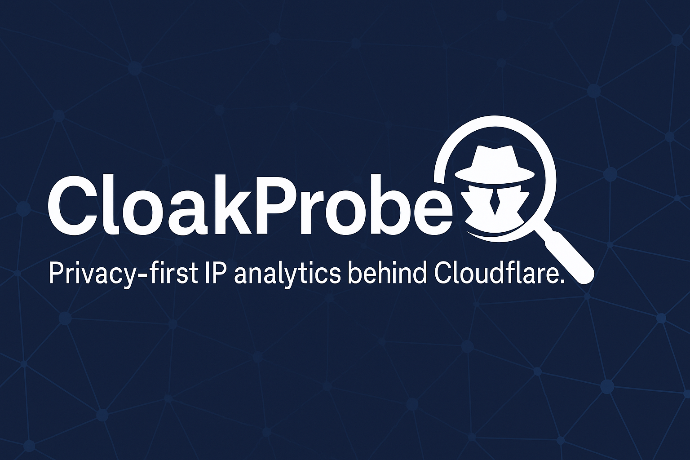

# CloakProbe

<div align="center">
  
</div>

<div align="center">

[](https://github.com/drmckay/cloakprobe/actions)
[](https://www.gnu.org/licenses/agpl-3.0)
[](https://www.rust-lang.org/)

Privacy-first, security-focused IP information service designed to run behind Cloudflare.

</div>

> ⚠️ **Commercial Use Notice**: This software is licensed under AGPL-3.0 with additional commercial use restrictions. Commercial use requires explicit written permission. See [LICENSE](LICENSE) for details.

## Features

- 🔒 **Privacy-first**: No tracking, no ads, no analytics
- 🛡️ **Security-focused**: Comprehensive security headers, input validation
- 🌐 **IPv4 & IPv6**: Full support for both IP versions
- 📊 **Detailed Information**: IP details, ASN lookup, network information, organization name
- 🎨 **Modern UI**: Beautiful dark theme, responsive design, one-click IP copy
- ⚡ **Fast**: Built with Rust for performance
- 🔧 **Easy Setup**: Simple configuration, Docker-ready
- 📡 **Cloudflare Integration**: Reads client IP from Cloudflare headers (CF-Connecting-IP)
- 🗄️ **Local ASN Database**: Uses ip2asn-based binary database (`asn_db.bin`)

## Requirements

- Rust (stable, e.g. 1.80+)
- Linux / macOS
- `curl`, `gunzip` (for gzip package)

## Installation

> 📖 **Detailed Installation Guide**: See [INSTALL.md](INSTALL.md) for comprehensive installation instructions, troubleshooting, and manual setup.

### Quick Install (from GitHub Release)

```bash
# Download and run the installation script
curl -fsSL https://raw.githubusercontent.com/drmckay/cloakprobe/main/install.sh | sudo bash

# Download ASN database
sudo /opt/cloakprobe/scripts/update_asn_db.sh

# Start the service
sudo systemctl start cloakprobe

# Check status
sudo systemctl status cloakprobe
```

### Manual Installation

```bash
git clone https://github.com/drmckay/cloakprobe.git
cd cloakprobe

# Build
cargo build --release

# Generate IP→ASN database
./scripts/update_asn_db.sh

# Run locally
CLOAKPROBE_PRIVACY_MODE=strict \
CLOAKPROBE_ASN_DB_PATH=./data/asn_db.bin \
CLOAKPROBE_REGION=eu-central \
  ./target/release/cloakprobe
```

Default address: `0.0.0.0:8080`.

### Systemd Service

The installation script automatically sets up a systemd service. Manual setup:

```bash
# Copy service file
sudo cp cloakprobe.service /etc/systemd/system/

# Edit paths if needed
sudo nano /etc/systemd/system/cloakprobe.service

# Reload systemd
sudo systemctl daemon-reload

# Enable and start
sudo systemctl enable cloakprobe
sudo systemctl start cloakprobe
```

### Environment Variables

- `CLOAKPROBE_PRIVACY_MODE`: `strict` or `balanced` (or `CFDEBUG_PRIVACY_MODE` - backward compatible)
- `CLOAKPROBE_ASN_DB_PATH`: Path to the ASN database binary file (default: `data/asn_db.bin`). Or `CFDEBUG_ASN_DB_PATH`.
- `CLOAKPROBE_RIPE_DB_PATH`: Path to the RIPE organization database (default: `data/ripe_db.bin`). Or `CFDEBUG_RIPE_DB_PATH`.
- `CLOAKPROBE_REGION`: Optional string, e.g. `eu-central`, appears in API response. Or `CFDEBUG_REGION`.
- `PORT`: Port to bind to (default: `8080`)

## API Endpoints

- `GET /` – HTML UI (dark card-based view with detailed IP information)
- `GET /api/v1/info` – JSON debug info
- `GET /api/v1/plain` – Plain text output, convenient for CLI
- `GET /healthz` – Health check, returns `{"status":"ok"}`

## Database Updates

CloakProbe uses two databases:

### 1. IP→ASN Database (ip2asn)

Uses the **ip2asn-combined.tsv.gz** database from [iptoasn.com](https://iptoasn.com/) (Public Domain / PDDL).

- Format: `range_start range_end AS_number country_code AS_description`
- Contains both IPv4 and IPv6 ranges.
- Script: `scripts/update_asn_db.sh`
- Output: `data/asn_db.bin`

### 2. RIPE Organization Database

Uses RIPE NCC database dumps to map ASN → Organization name.

- Sources: `ripe.db.aut-num` (ASN→org reference) + `ripe.db.organisation` (org details)
- Script: `scripts/update_ripe_db.sh`
- Output: `data/ripe_db.bin`

### Usage

```bash
cd /opt/cloakprobe
cargo build --release

# Update ASN database (IP ranges)
./scripts/update_asn_db.sh

# Update RIPE organization database (company names)
./scripts/update_ripe_db.sh
```

Then:

```bash
CLOAKPROBE_ASN_DB_PATH=/opt/cloakprobe/data/asn_db.bin \
CLOAKPROBE_RIPE_DB_PATH=/opt/cloakprobe/data/ripe_db.bin \
CLOAKPROBE_PRIVACY_MODE=strict \
  ./target/release/cloakprobe
```

### Cron Example

```cron
# Update ASN database daily at 3:00 AM
0 3 * * * /opt/cloakprobe/scripts/update_asn_db.sh >> /var/log/cloakprobe-asn-update.log 2>&1

# Update RIPE organization database daily at 4:00 AM
0 4 * * * /opt/cloakprobe/scripts/update_ripe_db.sh >> /var/log/cloakprobe-ripe-update.log 2>&1
```

---

## Running Behind Nginx (Reverse Proxy with Cloudflare)

Recommended architecture:

> Internet → Cloudflare → Nginx (reverse proxy) → CloakProbe (Rust, 127.0.0.1:8080)

1. Run the CloakProbe binary only on localhost, e.g.:

```bash
CLOAKPROBE_PRIVACY_MODE=strict \
CLOAKPROBE_ASN_DB_PATH=/opt/cloakprobe/data/asn_db.bin \
CLOAKPROBE_REGION=eu-central \
  ./target/release/cloakprobe
# The app listens on 0.0.0.0:8080; block it with firewall, only nginx should access it
```

2. Nginx configuration (example `/etc/nginx/conf.d/cloakprobe.conf`):

```nginx
upstream cloakprobe {
    server 127.0.0.1:8080;
}

server {
    listen 80;
    server_name ip.example.com;

    # Redirect all HTTP requests to HTTPS
    return 301 https://$host$request_uri;
}

server {
    listen 443 ssl http2;
    server_name ip.example.com;

    # SSL configuration (for Cloudflare "Full (strict)" mode, valid cert required on server)
    ssl_certificate     /etc/letsencrypt/live/ip.example.com/fullchain.pem;
    ssl_certificate_key /etc/letsencrypt/live/ip.example.com/privkey.pem;

    # Disable logging
    access_log off;
    error_log /dev/null crit;

    location / {
        proxy_pass http://cloakprobe;

        proxy_set_header Host              $host;
        proxy_set_header X-Real-IP         $remote_addr;
        proxy_set_header X-Forwarded-For   $proxy_add_x_forwarded_for;
        proxy_set_header X-Forwarded-Proto $scheme;

        proxy_http_version 1.1;
    }
}
```

3. Cloudflare Configuration

- The `ip.example.com` record should be **proxied** (orange cloud).
- TLS mode: `Full` or `Full (strict)`.
- The Rust app reads `CF-Connecting-IP`, `CF-Visitor`, `CF-Ray`, etc. headers –
  these are added by Cloudflare to the request, and nginx forwards them.

---

## Security Headers

The app sets the following HTTP headers on every response:

- `Content-Security-Policy`
- `Referrer-Policy`
- `X-Frame-Options`
- `Strict-Transport-Security`
- `X-Content-Type-Options`
- `Permissions-Policy`

No external scripts, fonts, or analytics sources; all assets come from the same domain.

---

## Contributing

Contributions are welcome! Please read our [Contributing Guide](CONTRIBUTING.md) and [Code of Conduct](CODE_OF_CONDUCT.md) first.

## License

This project is licensed under the **GNU Affero General Public License v3.0** with additional commercial use restrictions.

**Non-commercial use** (personal, educational, research, non-profit) is permitted under AGPL-3.0.

**Commercial use** requires explicit written permission from the copyright holders.

See [LICENSE](LICENSE) for full details.

## Security

Please report security vulnerabilities privately. See [SECURITY.md](SECURITY.md) for details.

## Development / Extension

- **ASN lookup**: `src/asn.rs` uses a binary prefix-range database from ip2asn.
- **Tor / VPN detection**:
  - The `NetworkInfo` struct contains `tor_exit` and `vpn_or_hosting` flags, these default to `false`.
- **Reverse DNS**:
  - `InfoResponse.reverse_dns` is currently `None`.
  - Async reverse lookup (with timeout) can be added later.

## Building Releases

To build release binaries for multiple architectures:

```bash
./scripts/build-release.sh [VERSION]
```

This creates tarballs in the `release/` directory for each architecture.

## Acknowledgments

- Uses [iptoasn.com](https://iptoasn.com/) data (Public Domain / PDDL)
- Uses [RIPE NCC](https://www.ripe.net/) database dumps for organization information
- Built with [Rust](https://www.rust-lang.org/) and [Axum](https://github.com/tokio-rs/axum)
